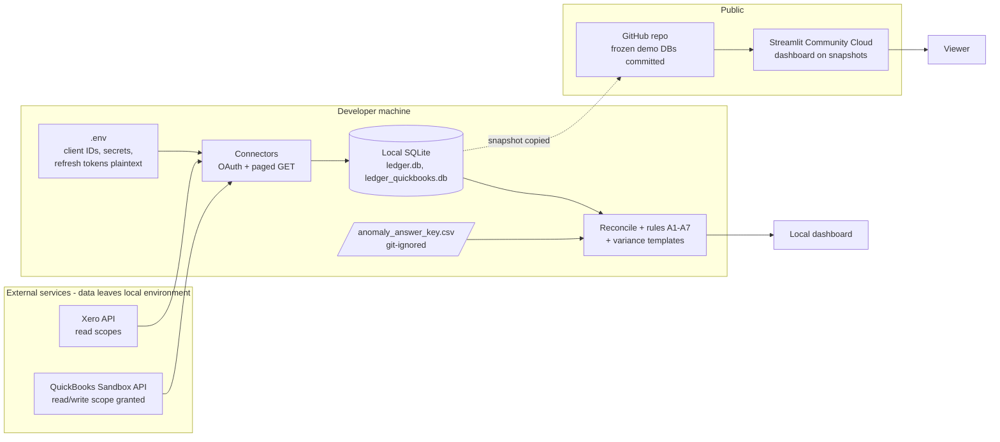

# System Description

**Subject:** Northbridge Ledger Agent, commit `9c4127ad65aa5a9e7d362c2d05f69ecfdbf7c5f9` (23 Sep 2026)
**Repository:** https://github.com/VAishwaryaSingh/Northbridge-Ledger-Agent
**Owner:** Aishwarya Singh (sole developer). No documented intended-use statement or named control owner beyond this (see Section 9).

Paths below are relative to the Northbridge repository. Items marked **[uncertain]** were not fully verified.

## 1. Purpose

Connects to Xero and QuickBooks Online, loads ledger data into SQLite, reconciles standalone bank transactions against invoices and bills, flags anomalies, and produces plain-English variance explanations. Presented as a portfolio project. The build plan (not the README) describes it as "not production software"; the README does not state production status (confirmed in Phase 4, E-04).

## 2. Is there an AI model?

**No LLM is called anywhere.** A search of the code for anthropic, openai, claude, gemini, llm, prompt, model and api_key found no use, and `requirements.txt` lists no LLM SDK. There is therefore no model, provider, version or prompt to inventory. The decision-making is:

| Component | Method | Source |
|---|---|---|
| Reconciliation | Fuzzy match on amount (±£5 or 2%), date (30 day exact, 45 day probable window) and contact | `src/reconciliation/matcher.py:17-20, 83-91` |
| A1 duplicate invoice | Same contact and total within 10 days, **sales invoices (ACCREC) only** | `src/anomaly/rules.py:35-58` |
| A2 VAT code mismatch | Line item tax code differs from the contact's established pattern | `src/anomaly/rules.py:72` |
| A3 threshold-adjacent amount | Amounts just under £500 | `src/anomaly/rules.py:119` |
| A4 weekend posting | Weekday is Saturday or Sunday (no holiday calendar evident in the excerpt read) | `src/anomaly/rules.py:146-160` |
| A5 duplicate payment | Bank line matches a bill that already has a linked payment | `src/anomaly/rules.py:177-192` |
| A6 unmatched bank line | Reconciliation `no_match` items | `src/pipeline.py:17-28` |
| A7 statistical outlier | Median/MAD modified z-score above 3.5 on payable line amounts, per account. Optional IsolationForest (`random_state=0`) is not the default | `src/anomaly/statistical.py:13-60, 80` |
| Variance explanation | String templates over SQL aggregates; no network code | `src/variance/explainer.py:48-99` |

Because the behaviour is deterministic, the same input should produce the same output. This is tested rather than assumed in Phase 4.

The README (`README.md:5`) positions the tool as "a small-scale version of the kind of AI-native ledger automation product accounting firms are increasingly adopting", and the title calls it an "Agent". That describes the product category the project imitates rather than claiming the tool uses AI, but it does not say that no model is used, and nothing in the tool is agentic (no model, no autonomous action). The README mentions "rule-based checks" only in its accuracy section (line 108). Recorded for evaluation as a transparency matter.

## 3. Components

| Component | Path |
|---|---|
| Xero connector (OAuth, paged pulls) | `src/connectors/xero_connector.py` |
| QuickBooks connector and adapter | `src/connectors/quickbooks_connector.py`, `quickbooks_adapter.py` |
| Load into SQLite (upsert) and schema | `src/db/load.py`, `src/db/schema.sql` |
| Reconciliation and coverage stats | `src/reconciliation/matcher.py`, `stats.py` |
| Anomaly rules | `src/anomaly/rules.py`, `statistical.py` |
| Shared pipeline | `src/pipeline.py` (`detect_all`, runs matcher output plus six rule steps) |
| Variance explainer | `src/variance/explainer.py` |
| Dashboard | `dashboard/app.py` (Streamlit) |
| Synthetic data generator | `src/seed_synthetic.py` (seed 42, 5,000 bank transactions) |
| Scoring | `score_against_answer_key`, `score_against_planted_records` in `src/anomaly/statistical.py` |

## 4. Inputs and outputs

**Inputs:** live Xero trial organisation (OAuth); QuickBooks sandbox company (OAuth); frozen SQLite snapshots (`data/demo_ledger.db`, `demo_ledger_quickbooks.db`, `demo_ledger_large.db`); the synthetic seed. All data is fictional or Intuit/Xero demo data.

**Outputs:** Streamlit dashboard tables and metrics (reconciliation summary, anomaly list with reasons, precision and recall, variance sentences); CLI reports from `src/detect_anomalies.py` and `src/reconcile.py`. The dashboard does not write files or write back to the ERPs (no file-write or network code found in `dashboard/app.py`).

**Who acts on outputs:** not documented. There is no accept, reject, override or sign-off step in the code. The reviewer is implicit.

## 5. Data flow

Where data leaves the environment: API calls to `api.xero.com`, `login.xero.com`, `identity.xero.com`, `sandbox-quickbooks.api.intuit.com`, `appcenter.intuit.com` and `oauth.platform.intuit.com`; and publication of frozen demo databases to GitHub and Streamlit Cloud. No LLM provider receives data. The public dashboard makes no live API calls and shows a hard-coded published score when the private answer key is absent (`dashboard/app.py:35-41, 173-178`).

## 6. Access and permissions

- **Xero:** scopes are all `.read` plus `offline_access`, `openid`, `profile`, `email` (`src/connectors/xero_connector.py:18-28`). Only POSTs are token exchange and refresh (`:75`, `:91`).
- **QuickBooks:** scope requested is `com.intuit.quickbooks.accounting`, which is **read/write**, although the code only issues queries (GET) and token POSTs (`src/connectors/quickbooks_connector.py:24, 73, 90`). Read-only behaviour is a property of the code, not of the granted permission.

## 7. Secrets

Credentials are stored in a local `.env` (git-ignored; `.env.example` with blanks is committed). Refresh tokens are written back to `.env` in plaintext by `save_tokens` (`src/connectors/xero_connector.py:190-193`). `git log --all -- .env` returned no history, so `.env` was never committed. No use of `st.secrets`. Secret values were not read during this review. A secrets scan is reported in the build plan (Session 6); an independent scan of all history at the pinned commit found no credentials (Phase 4, evidence log E-04).

## 8. Logging, persistence and change control

- **Run logging:** none found. No logging module use, input hash, code version, timestamp or run table. The schema has six data tables (accounts, contacts, invoices, bank_transactions, payments, line_items) and no audit table.
- **Persistence:** local SQLite (`ledger.db`, `ledger_quickbooks.db`, git-ignored) and three committed demo snapshots.
- **Automated tests:** none (no `tests/` directory).
- **Dependencies:** `requirements.txt` is unpinned (python-dotenv, requests, requests-oauthlib, pandas, scikit-learn, streamlit); no lockfile. Local environment observed: Python 3.11, streamlit 1.64.0.
- **Version history:** 13 commits on `main`; no releases or tags noted.
- **Development provenance:** built largely with Claude Code per the build plan's session log.

## 9. Existing validation and documented limitations

| Result | Value | Caveat stated by the project |
|---|---|---|
| Xero planted anomalies | 7 of 7 caught, 3 false positives, precision 0.70, recall 1.00 | Very small live sample (about 5 bank lines and 46 payments); A2 rule tailored to per-contact VAT |
| Synthetic (5,000 bank lines) | 84 of 84 caught, 24 false positives, precision 0.778 | "Planted patterns were written to fit the rules"; shows scale and mechanics, not accuracy |
| QuickBooks | No answer key, no accuracy claim | Sandbox data; auto-matches 0 of 40 bank lines (not investigated) |
| Pagination | Tested against mocks only | Not re-run against live APIs |

The private answer key (`data/anomaly_answer_key.csv`) is git-ignored and present locally only.

**Not documented:** intended use, named control owner, users of the output, known limitations on real books (materiality, false negatives), or how an unusual result would be handled.

## 10. Observations to test in Phase 4 (not conclusions)

- A1 checks sales invoices only; whether duplicate supplier bills (ACCPAY) are detected by any rule is untested.
- A1 compares adjacent rows after sorting, so behaviour with three or more near-identical entries needs testing.
- A4 flags all weekend postings; false positive behaviour on legitimately weekend-dated items needs testing.
- A3 uses a fixed £500 threshold.
- Reconciliation tolerances and windows are fixed constants, not configurable or documented as approved.

## 11. Uncertain items

- Contents of `src/seed_synthetic.py` beyond its header, and `src/reconciliation/stats.py`, were not read in full.
- Whether any script writes output files other than to `data/`.
- Current Streamlit deployment state and commit deployed.
- QuickBooks production (non-sandbox) scope behaviour.
